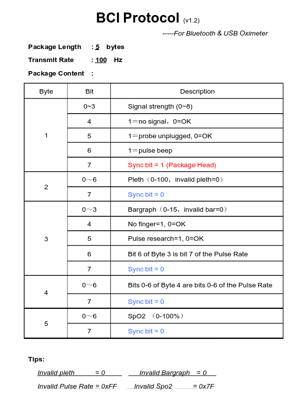

= Setocare ST-T130-U01 Spo2 sensor communication protocol

The sensor communicates over serial port:

- Baud rate: 4800
- Data bits: 8
- Stop bits: 1
- Parity bits: none

Sensor implements so called BCI protocol.

- It constantly sends data packets of 5 bytes.
- Each packet represents one measurement sample.
- Sampling rate is about 60 Hz.

BCI protocol packet format:

